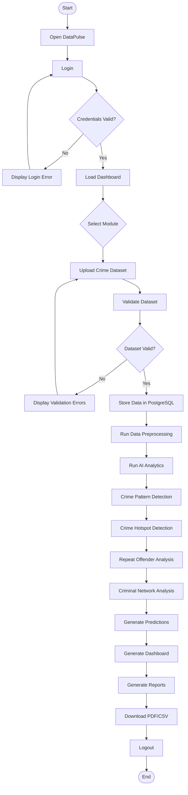

# Activity Diagram

## Overview

The Activity Diagram describes the workflow of the DataPulse platform from user authentication to crime analysis and report generation.

It illustrates how crime data moves through different modules of the system until meaningful insights are presented to the user.

---

## Purpose

The Activity Diagram helps developers understand:

- System workflow
- Decision points
- Processing sequence
- AI execution flow
- Report generation process

---

## Workflow

---

# Explanation

## Login

The user authenticates using secure credentials.

---

## Dataset Upload

Crime records are uploaded in CSV or Excel format.

---

## Validation

The uploaded dataset is checked for:

- Missing values
- Duplicate records
- Invalid crime categories
- Invalid district names

---

## Data Storage

Validated data is stored inside PostgreSQL.

---

## AI Processing

The AI engine performs:

- Crime Trend Analysis
- Crime Pattern Detection
- Repeat Offender Identification
- Hotspot Detection
- Criminal Relationship Analysis
- Risk Prediction

---

## Dashboard

The processed insights are displayed through:

- KPI Cards
- Charts
- Maps
- Heatmaps
- Network Graphs

---

## Report Generation

Users can export:

- PDF Reports
- CSV Reports

---

## Logout

The session is terminated securely.

---

# Diagram

---

# Mermaid Source

(Paste the Mermaid code here.)

---

# Future Enhancements

Future workflow improvements may include:

- Live Crime Streaming
- AI Chatbot Interaction
- Voice Commands
- Automatic Alert Notifications
- Real-Time CCTV Analysis