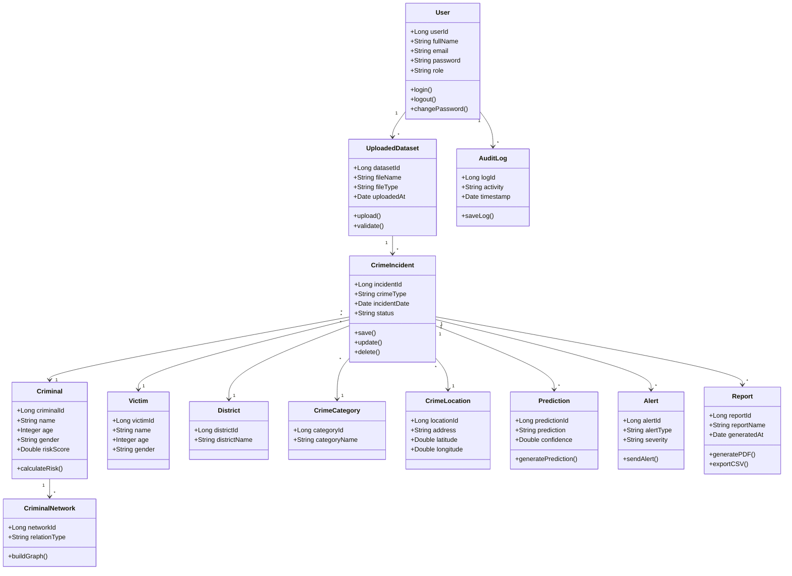

# Class Diagram

## Overview

The Class Diagram represents the object-oriented structure of the DataPulse platform.

It defines the major classes, their attributes, methods, and relationships. These classes will later be implemented as Java entity classes in the Spring Boot backend.

---

# Purpose

The Class Diagram helps developers:

- Understand the software structure
- Define object relationships
- Design Java entity classes
- Plan backend implementation
- Maintain modular architecture

---

# Mermaid Diagram

---

# Class Responsibilities

## User

Responsible for authentication and authorization.

---

## UploadedDataset

Handles CSV and Excel uploads.

---

## CrimeIncident

Stores all crime records.

---

## Criminal

Stores criminal information and risk score.

---

## Victim

Stores victim information.

---

## District

Stores district details.

---

## CrimeCategory

Stores crime category information.

---

## CrimeLocation

Stores geospatial coordinates.

---

## Prediction

Stores AI-generated predictions.

---

## Alert

Stores system-generated alerts.

---

## Report

Handles report generation.

---

## CriminalNetwork

Stores criminal relationship information.

---

## AuditLog

Stores system activity logs.

---

# Diagram

---

# Mermaid Source

(Paste Mermaid code here.)

---

# Future Enhancements

Future classes may include:

- PoliceStation
- FIR
- Evidence
- Vehicle
- CCTVRecord
- AIChat
- Notification
- CaseManagement