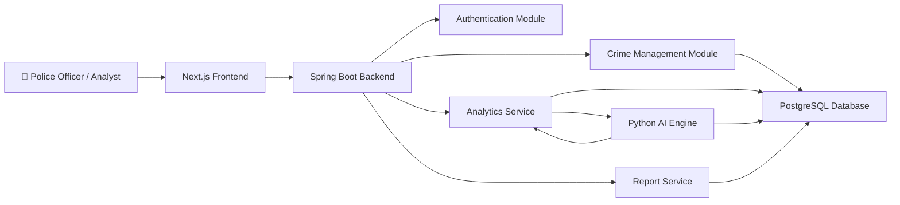

# Component Diagram

## Overview

The Component Diagram illustrates the high-level architecture of the DataPulse platform. It shows the major software modules and how they communicate with each other.

The architecture follows a modular, service-oriented design where each component has a specific responsibility.

---

# Purpose

The Component Diagram helps developers:

- Understand the overall software architecture.
- Identify major modules.
- Define communication between components.
- Support modular development.
- Improve maintainability and scalability.

---

# Main Components

- Next.js Frontend
- Spring Boot Backend
- Authentication Module
- Crime Management Module
- Analytics Module
- AI Engine
- Report Service
- PostgreSQL Database

---

# Component Diagram

---

# Component Responsibilities

## Frontend (Next.js)

Responsible for:

- Login
- Dashboard
- Charts
- Maps
- Reports
- User Interaction

---

## Spring Boot Backend

Responsible for:

- Business Logic
- REST APIs
- Validation
- Authentication
- Security

---

## Authentication Module

Responsible for:

- Login
- JWT Authentication
- Authorization
- User Roles

---

## Crime Management Module

Responsible for:

- Crime CRUD Operations
- Dataset Upload
- Data Validation
- Search
- Filtering

---

## Analytics Service

Responsible for:

- Dashboard Statistics
- District Analysis
- Category Analysis
- Trend Analysis
- AI Integration

---

## Python AI Engine

Responsible for:

- Crime Prediction
- Hotspot Detection
- Repeat Offender Detection
- Criminal Network Analysis
- Risk Scoring
- Anomaly Detection

---

## Report Service

Responsible for:

- PDF Reports
- CSV Export
- Dashboard Reports

---

## PostgreSQL Database

Stores:

- Users
- Crime Records
- Criminals
- Victims
- Reports
- Predictions
- Alerts

---

# Diagram

---

# Mermaid Source

(Paste the Mermaid code here.)

---

# Future Enhancements

Future architecture may include:

- Redis Cache
- Kafka Event Streaming
- Elasticsearch
- Docker
- Kubernetes
- API Gateway
- Notification Service
- Mobile Application