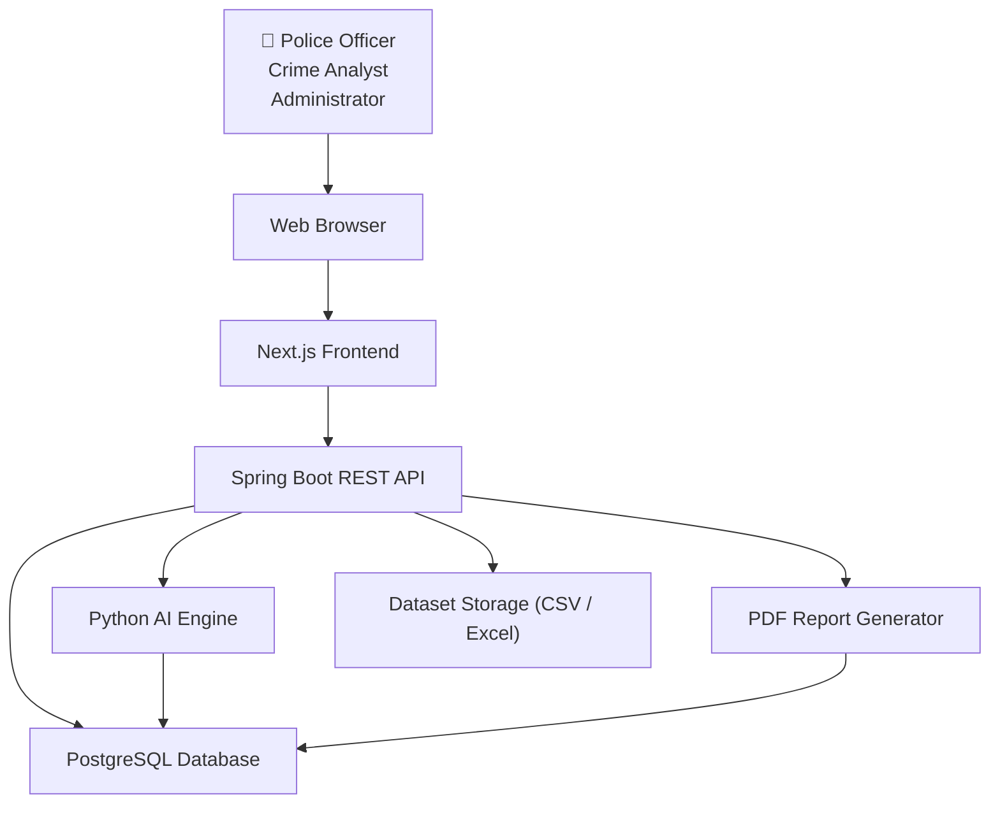

# Deployment Diagram

## Overview

The Deployment Diagram illustrates the physical deployment architecture of the DataPulse platform.

It shows how different software components are deployed across various nodes and how they communicate during runtime.

The architecture follows a modular cloud-based deployment model suitable for scalable AI-powered crime analytics.

---

# Purpose

The Deployment Diagram helps developers:

- Understand deployment architecture.
- Visualize communication between services.
- Plan server infrastructure.
- Prepare cloud deployment.
- Improve scalability.

---

# Deployment Architecture

---

# Deployment Nodes

## Client Node

Runs:

- Web Browser
- Responsive UI

---

## Frontend Server

Technology:

- Next.js

Responsibilities:

- User Interface
- Dashboard
- Charts
- Maps
- Authentication Pages

---

## Backend Server

Technology:

- Spring Boot

Responsibilities:

- REST APIs
- Business Logic
- Security
- Authentication
- Validation

---

## AI Server

Technology:

- Python

Libraries:

- Pandas
- Scikit-learn
- NetworkX
- GeoPandas

Responsibilities:

- Crime Prediction
- Hotspot Detection
- Criminal Network Analysis
- Risk Scoring
- Anomaly Detection

---

## Database Server

Technology:

- PostgreSQL

Stores:

- Users
- Crime Records
- Criminals
- Reports
- Alerts
- Predictions

---

## File Storage

Stores:

- Uploaded CSV files
- Generated Reports
- PDF Exports

---

# Diagram

---

# Mermaid Source

(Paste Mermaid code here.)

---

# Future Deployment

Future versions may deploy using:

- Docker
- Kubernetes
- Nginx
- Redis
- Kafka
- AWS
- Azure
- Zoho Catalyst