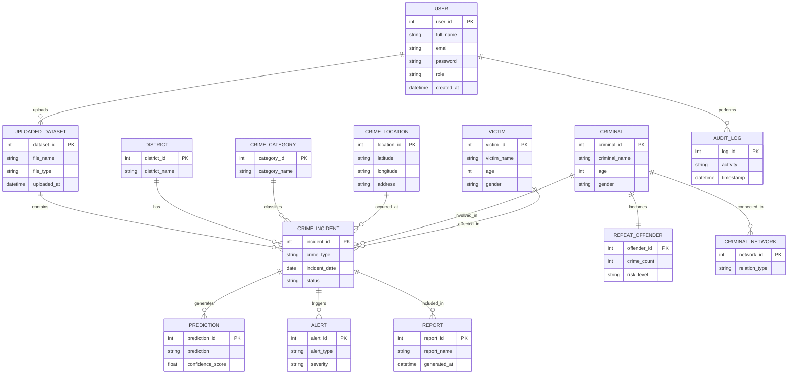

# Entity Relationship (ER) Diagram

## Overview

The ER Diagram represents the database structure of the DataPulse platform. It defines all entities, their attributes, and the relationships between them.

This database is designed to support crime analytics, AI prediction, hotspot detection, report generation, and criminal network analysis.

---

## Purpose

The ER Diagram helps developers:

- Design the PostgreSQL database
- Define entity relationships
- Avoid data redundancy
- Build backend JPA entities
- Create REST APIs

---

## ER Diagram

---

# Relationship Summary

| Parent | Child | Relationship |
|----------|--------|--------------|
| User | UploadedDataset | One-to-Many |
| UploadedDataset | CrimeIncident | One-to-Many |
| District | CrimeIncident | One-to-Many |
| CrimeCategory | CrimeIncident | One-to-Many |
| CrimeLocation | CrimeIncident | One-to-Many |
| Criminal | CrimeIncident | One-to-Many |
| Victim | CrimeIncident | One-to-Many |
| Criminal | RepeatOffender | One-to-One |
| Criminal | CriminalNetwork | One-to-Many |
| CrimeIncident | Prediction | One-to-Many |
| CrimeIncident | Alert | One-to-Many |
| CrimeIncident | Report | One-to-Many |
| User | AuditLog | One-to-Many |

---

# Diagram

---

# Mermaid Source

(Paste the Mermaid code here.)

---

# Future Improvements

Future versions may include:

- Police Station entity
- Evidence Management
- CCTV Records
- Vehicle Tracking
- FIR Management
- Case Management
- Court Proceedings
- AI Chat History