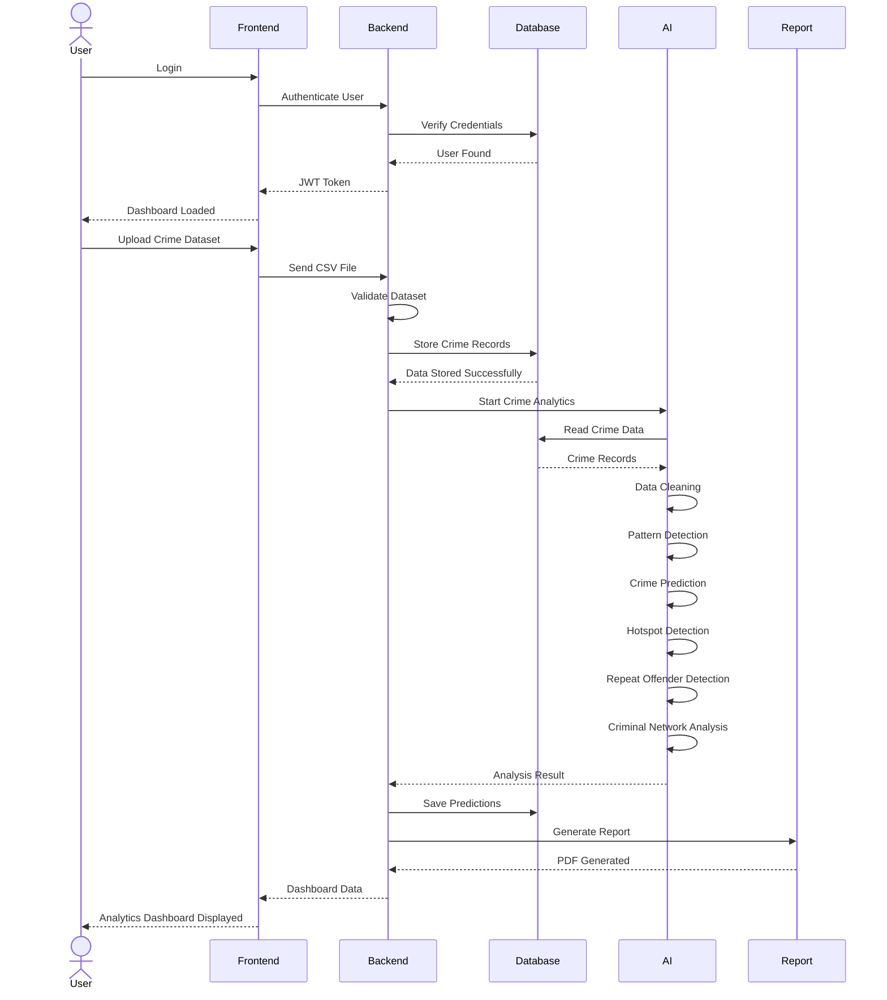
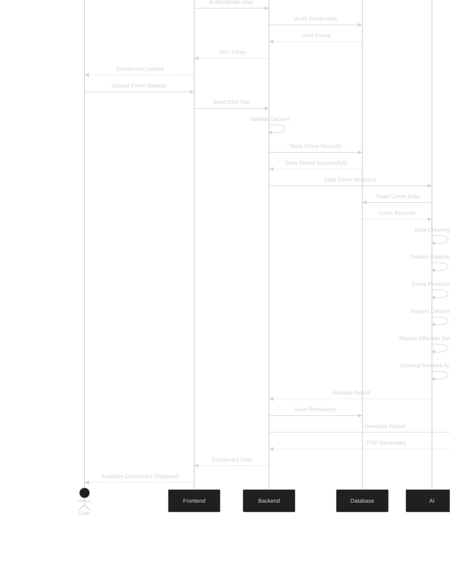

# Sequence Diagram

## Overview

The Sequence Diagram illustrates how different components of the DataPulse platform interact when a crime dataset is uploaded for analysis.

This workflow represents one of the primary use cases of the application, demonstrating communication between the user interface, backend services, database, AI engine, and report generation module.

---

# Purpose

The Sequence Diagram helps developers understand:

- Communication between system components
- Order of execution
- Backend workflow
- AI processing pipeline
- Data storage sequence
- Report generation process

---

# Participants

- Police Officer / Crime Analyst
- Frontend (Next.js)
- Backend API (Spring Boot)
- PostgreSQL Database
- Python AI Engine
- Report Service

---

# Sequence Diagram

---

# Workflow Explanation

## Step 1

The user logs into the application.

---

## Step 2

The backend authenticates the user by checking credentials stored in PostgreSQL.

---

## Step 3

After successful authentication, the dashboard is loaded.

---

## Step 4

The user uploads a CSV or Excel crime dataset.

---

## Step 5

Spring Boot validates the uploaded dataset.

---

## Step 6

Validated records are stored in PostgreSQL.

---

## Step 7

The backend invokes the Python AI Engine.

---

## Step 8

The AI Engine performs:

- Data Cleaning
- Pattern Detection
- Crime Trend Analysis
- Crime Hotspot Detection
- Repeat Offender Identification
- Criminal Network Analysis
- Crime Prediction

---

## Step 9

The AI results are returned to the backend.

---

## Step 10

Predictions are stored in the database.

---

## Step 11

A report is generated.

---

## Step 12

The frontend displays:

- Dashboard
- Charts
- Heatmaps
- Criminal Network Graph
- Predictions
- Reports

---

# Diagram

---

# Mermaid Source

(Paste the Mermaid code here.)

---

# Future Sequence Diagrams

Additional sequence diagrams will be created for:

- Login Authentication
- Crime Search
- Alert Generation
- Report Download
- Criminal Network Visualization
- AI Prediction Module